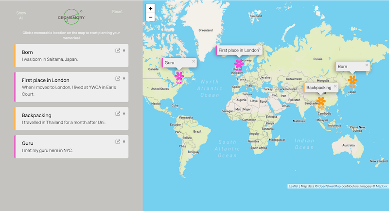

# GeoMemory

This project built with vanila Javascript uses Leaflet interactive map to visualize your memories by logging on a map like planting flowers.

## Screenshot



### Links

- Live Site URL: [https://geomemory-usisha.netlify.app/](https://geomemory-usisha.netlify.app/)

## Functionalities

- Responsive web design
- Abilities to edit & delete a log and clear all loggings.
- Position the map to show all makers.
- Click on a log, move map to a corresponding popup

## Built with

- Semantic HTML5 markup
- CSS custom properties
- Vanilla Javascript
- Flexbox
- Responsive Web Design
- [Leaflet](https://leafletjs.com/) - JavaScript library

```JS
 if (navigator.geolocation) navigator.geolocation.getCurrentPosition( function (position) { const { latitude } = position.coords; const { longitude } = position.coords;
 console.log(`https://www.google.co.uk/maps/@${latitude}, ${longitude}`);
},
function () {
alert('could not get your position');
}
);
```

## Acknowledgement

This project is based on [Jonas Schmedtmann](https://github.com/jonasschmedtmann)'s Mapty project.

<a href="https://icons8.com/icon/86373/edit">Edit icon by Icons8</a>
